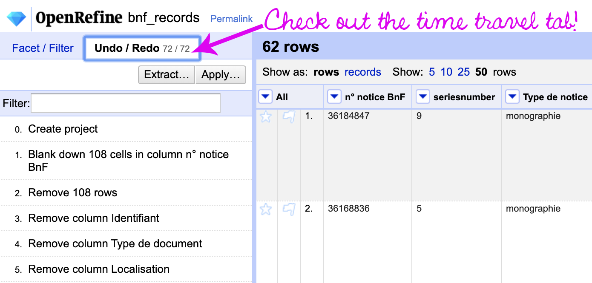

# Data Sitters Club Multilingual Mystery 3: Quinn and Lee Clean Up Ghost Cat Hairballs
Need data, templates, and examples for the [Data Sitters Club Multilingual Mystery #3: Quinn and Lee Clean Up Ghost Cat Hairballs](https://datasittersclub.github.io/site/dscm3/)? We've got it all right here.

## Web scraping
* [Webscraper.io sitemap for scraping Baby-Sitters Club book links](bsc_fan_wiki_link_scraper.txt)
* [CSV of scraped Baby-Sitters Club book links](bsc_fan_wiki_link_scraper.csv)
* [Markdown page of scraped links (for use in the metadata scraper)](bsc_wiki_links.md)
* [Webscraper.io sitemap for scraping Baby-Sitters Club book metadata](bsc_book_metadata.txt)
* [CSV of scraped Baby-Sitters Club book metadata](bsc_book_metadata.csv)

## Data cleaning
* [OpenRefine project for scraped wiki data](bsc_book_metadata.openrefine.tar.gz)
* [CSV of Quebec National Library records](quebec_records.csv)
* [OpenRefine project for Quebec National Library records](quebec_records.openrefine.tar.gz)
* [CSV of French National Library records](bnf_data.csv)
* [OpenRefine project for French National Library records](bnf_records.openrefine.tar.gz)
* [ExportPro CSV of series info from the French National Library](ExportPro.csv)
* [OpenRefine project for ExportPro CSV](ExportPro.openrefine.tar.gz)
* [OpenRefine project for Belgian Baby-Sitters Club books in the French National Library](bnf_records_belgian.openrefine.tar.gz)

With any of the OpenRefine projects, you can use the "Undo/Redo" tab to walk back through the project step by step!

